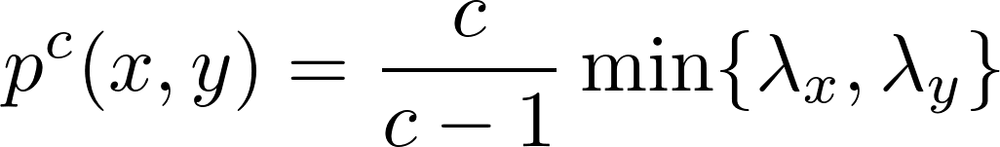

# distance_sparcifier

### Description 
`distance_sparcifier` is a `C++` code to sparcify distance
matrices as a preprocessing step for the computation of sparse
Vietoris-Rips persistence barcodes. The code for reading distance
matrices, the help and the examples are based on
[`Ripser`](https://github.com/Ripser).

Sparcification is based on [Cavanna et al](https://arxiv.org/abs/1506.03797). Let P be a furthest point
sampling of a point cloud with insertion radii λi. Given an
interleaving constant c of at least 1.0, we sparsify the edge list for the full Rips complex. First let



and then set the new distances


Note that the last term should be infinite, but we use twice the maximum distance because infinity cannot be read by `Ripser`. Using `distance_sparcifier` together with `Ripser` leads to c-interleaved persistence diagrams. Remember to use a threshold between the maximum distance and twice the maximum distance for the sparsification to save time. 

### Building

`distance_sparcifier` requires a C++11 compiler. Here is how to obtain and build `distance_sparcifier`:

```sh
git clone https://github.com/blasern/distance_sparcifier
cd distance_sparcifier
make
```

### Use

Here is how to run `distance_sparcifier` and writing the output to a lower distance matrix file:

```sh
./distance_sparcifier --interleaving 1.2 examples/sphere_3_192.lower_distance_matrix > examples/sphere_3_192_sparse_1.2.lower_distance_matrix
./distance_sparcifier --interleaving 2.0 examples/sphere_3_192.lower_distance_matrix > examples/sphere_3_192_sparse_2.0.lower_distance_matrix
./distance_sparcifier --interleaving 5.0 examples/sphere_3_192.lower_distance_matrix > examples/sphere_3_192_sparse_5.0.lower_distance_matrix
```

After this preprocessing step, run `Ripser` as usual: 
```sh
./ripser examples/sphere_3_192.lower_distance_matrix
./ripser examples/sphere_3_192_sparse_1.2.lower_distance_matrix 
./ripser examples/sphere_3_192_sparse_2.0.lower_distance_matrix
./ripser examples/sphere_3_192_sparse_5.0.lower_distance_matrix
```
